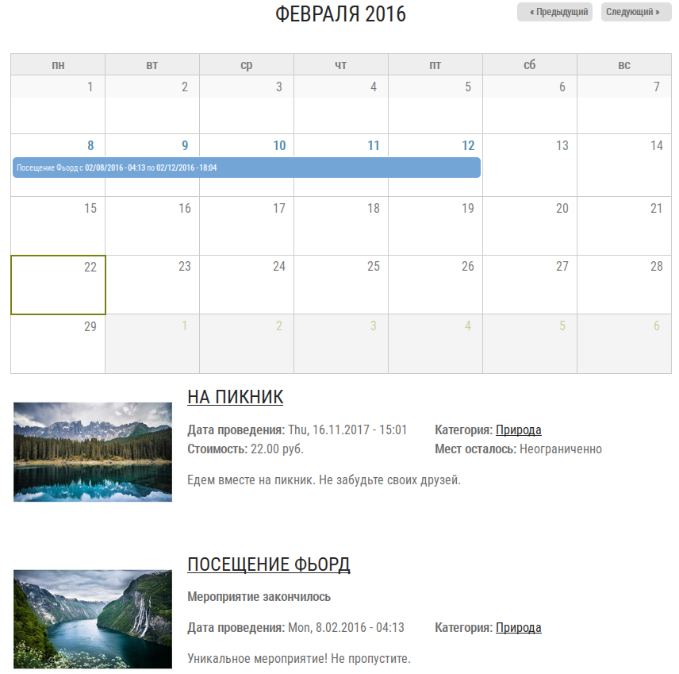
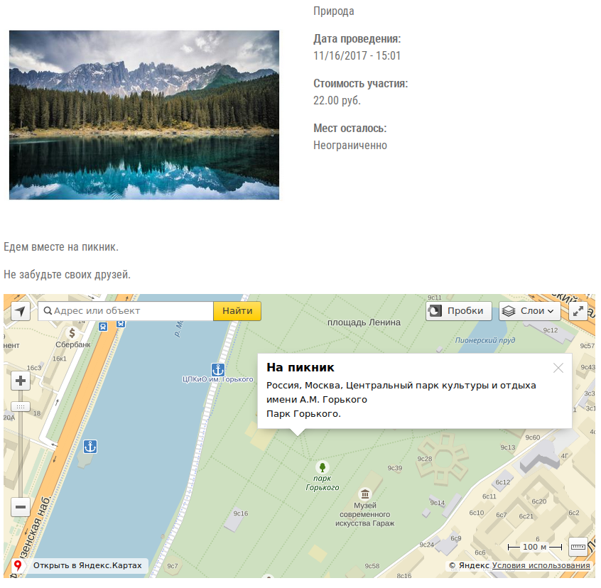
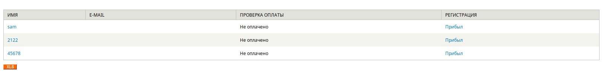
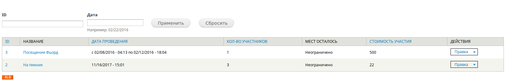

# Мероприятия

Создание и управление проведением мероприятий. Регистрация учатников прямо на сайте с возможностью оплаты онлайн.

**Скриншоты в конце описания**

* Календарь
* Карта
* Категоризация
* Платные мероприятия
* Ограничение на количество участников
* Список участников
* Сбор информации о участниках
* Выгрузка участников в Excel
* Отметка о прибытии/убытии участника

Требуемые модули от SL7:
* [sl7_control_panel](https://github.com/SemyonDragunov/sl7_control_panel)
* *Если хотите делать оплату онлайн.* [sl7_payment](https://github.com/SemyonDragunov/sl7_payment)
* Способы оплаты.

Для Drupal 7. PHP =< 5.4

Для продолжения разработки css смотрите bower.json

Автор: Семён Драгунов [sam.dragunov@gmail.com](sam.dragunov@gmail.com)

Apache License 2.0

Если необходима английская версия модуля, пишите **@SemyonDragunov**

***
# Events

Creation and management of events. Registration of students directly on the site with the ability to pay online.

**Screenshots at the end of the this description**

* The calendar
* Map
* Categorization
* Paid events
* Restriction on the number of participants
* List of participants
* Gathering information about the participants
* Unloading participants in Excel
* Mark of arrival / departure of participant

Required modules from SL7:
* [sl7_control_panel](https://github.com/SemyonDragunov/sl7_control_panel)
* *If you want to make payment online.* [sl7_payment](https://github.com/SemyonDragunov/sl7_payment)
* Payment methods.

For Drupal 7. PHP =< 5.4

To continue developing css, see bower.json

Author: Semyon Dragunov [sam.dragunov@gmail.com](sam.dragunov@gmail.com)

Apache License 2.0

If you need an English version of the module, write to user **@SemyonDragunov**

***

